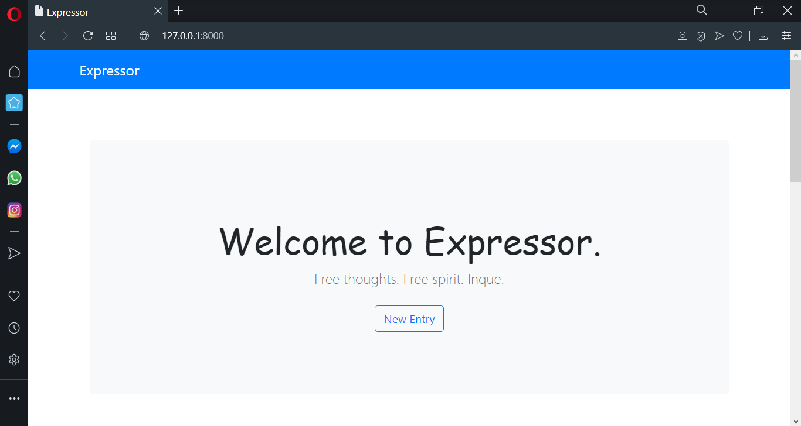
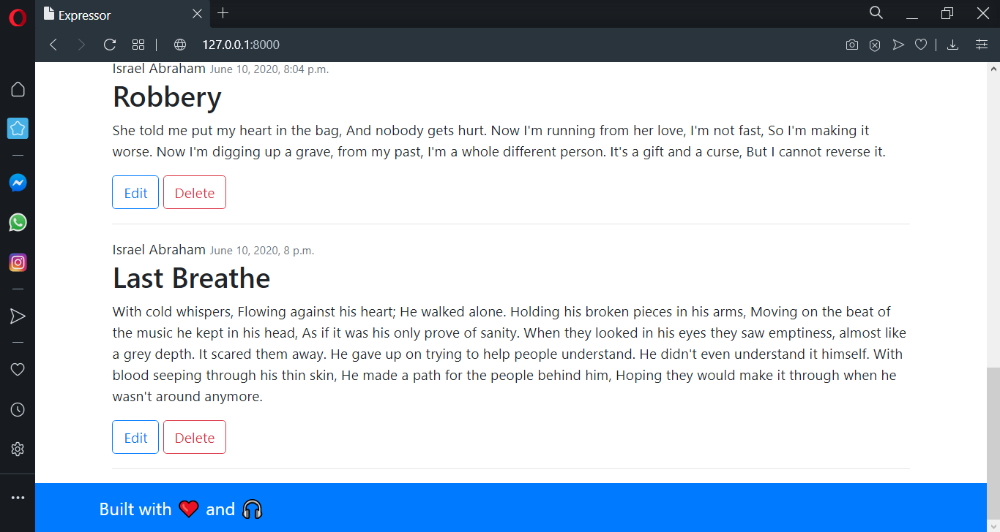

#DIARY-APP(Expresso)
---------------------------
This is a simple CRUD Diary Application built using Django that allow users to Create, Retrieve/Read, Update and Delete an entry.


<br>
The interface is as shown:





<br>

#FEATURES
* Users can Add entries.
* Users can Edit entries.
* Users can Delete entries.
* Responsive UI (Bootstrap4)

<br>
To get it running on your local machine, follow the steps below:

1. Run the commands below in your terminal:

```
git clone https://github.com/israelvictory/Expresso.git
```

2. change directory to diary:

```
cd Expresso/diary
```

3. Install the requirements with the command below:
```
pip install -r requirements.tx
```

4. Run the development server with
```
python manage.py runserver
```

5. Launch your browser and navigate to:
```
http://127.0.0.1:8000
```